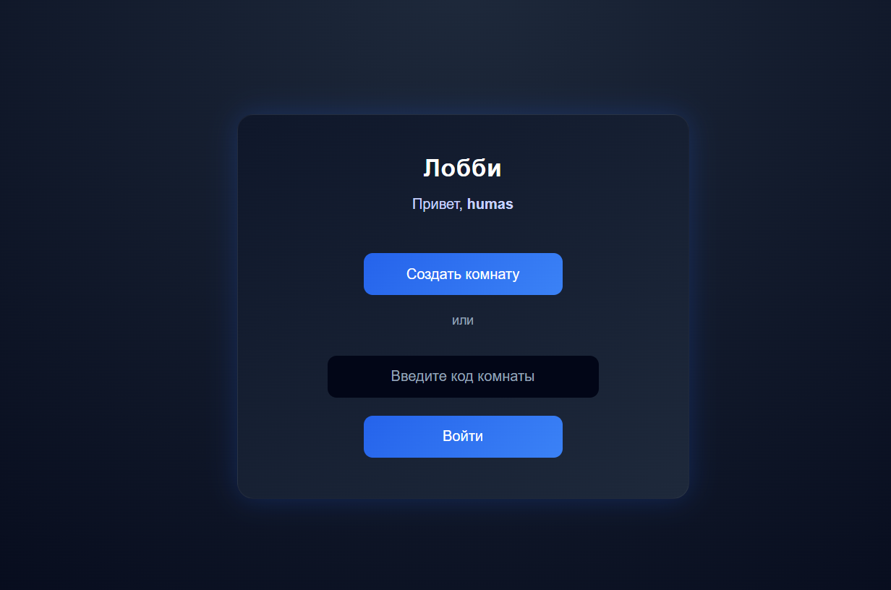
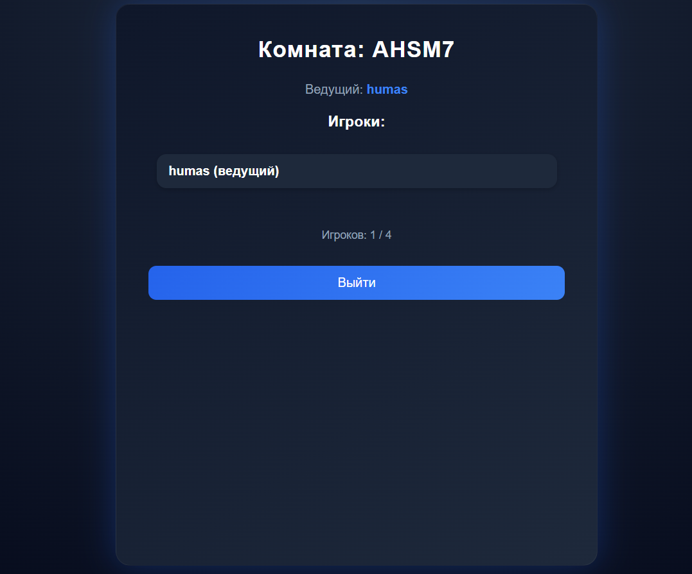
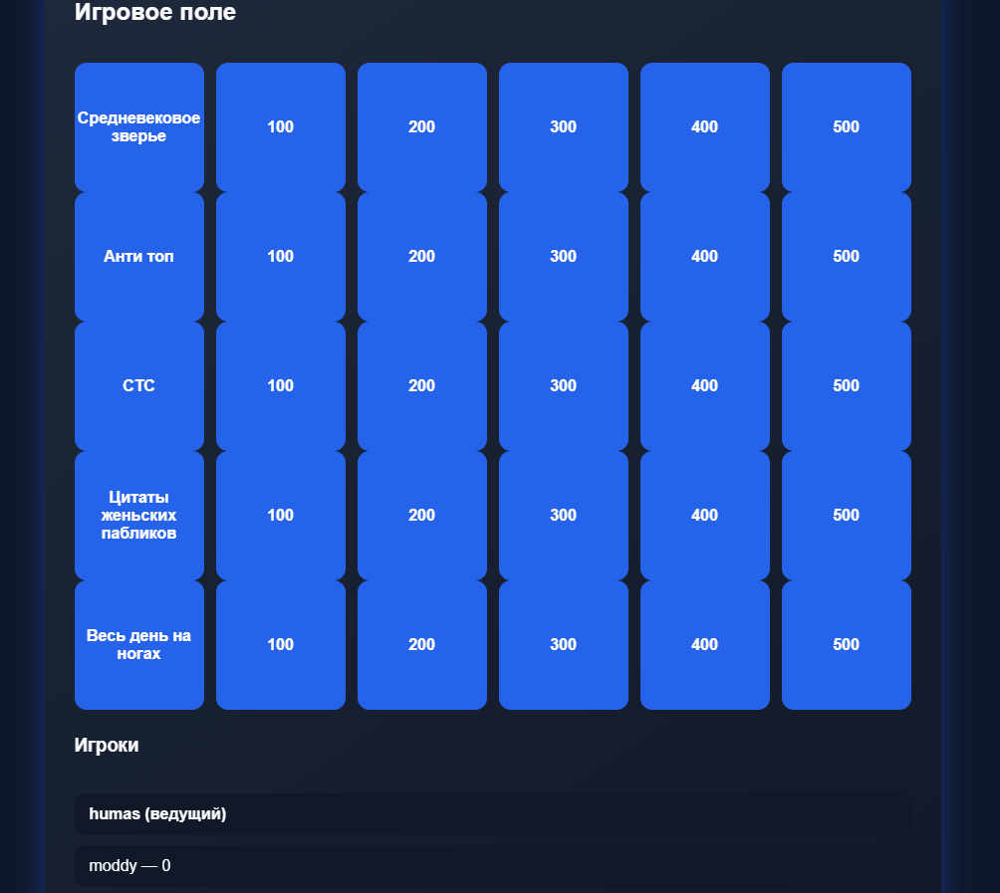

# {Russiun} SVOYAK Это игра с телешоу "Своя Игра" собираются три участника и один ведущий, можно создать свое лобби(Создатель лобби автоматический становится ведущим) и с помощью сгенерированного кода для входа в игру участники присоеденяются к игре, ведущий может начать игру, после этого вам отображаются поля с темами и наминалом от 100 до 500 участник выберает тему и наминал а ведущий управляет всем этим так же есть система с баллами если участник ответил правильно или неправильно, баллы добавляются или отнемаются.

# {English} SVOYAK is a game from the TV show "Svoya Igra" (Your Own Game). Three participants and one host gather together. You can create your own lobby (the lobby creator automatically becomes the host). Participants join the game using a generated code to enter the game. The host can start the game. After this, you are shown fields with topics and a denomination from 100 to 500. The participant chooses a topic and a denomination, and the host manages everything. There is also a points system. If the participant answers correctly or incorrectly, points are added or subtracted.

# Создание лобби

# Комната

# Игра

# Использованные технологий/Technologies used
1. JavaScript
2. Firebase(Для Деплоя + База данных и автоиризации пользователя/For Deployment + Database and User Authorization)

[Link](https://svoyak-85115.web.app/).
